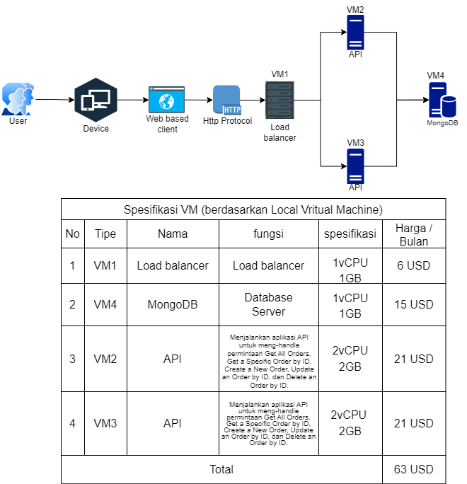

# Final Project
## Teknologi Komputasi Awan (B)

Kelompok 1
| NRP | Nama |
| ------ | ------ |
| 5027221001 | Dwiyasa Nakula |
| 5027221003 | Mohammad Arkananta Radithya Taratugang |
| 5027221004 | Agas Ananta Wijaya |
| 5027221009 | Asadel Naufaleo |

### Permasalahan
Anda adalah seorang lulusan Teknologi Informasi, sebagai ahli IT, salah satu kemampuan yang harus dimiliki adalah Kemampuan merancang, membangun, mengelola aplikasi berbasis komputer menggunakan layanan awan untuk memenuhi kebutuhan organisasi.(menurut kurikulum IT ITS 2023 😙)

Pada suatu saat teman anda ingin mengajak anda memulai bisnis di bidang digital marketing, anda diberikan sebuah aplikasi berbasis API File: [app.py](https://github.com/fuaddary/fp-tka/blob/main/app.py) dengan spesifikasi sebagai berikut.

Kemudian anda diminta untuk mendesain arsitektur cloud yang sesuai dengan kebutuhan aplikasi tersebut. Apabila dana maksimal yang diberikan adalah 1 juta rupiah per bulan (65 US$) konfigurasi cloud terbaik seperti apa yang bisa dibuat?

### Rancangan Arsitektur dan Tabel Harga Spesifikasi VM
Berikut adalah rancangan arsitektur dan tabel harga spesifikasi VM yang telah kami buat untuk final project ini.
Arsitektur kami memilih untuk menggunakan Digital Ocean sebagai lingkungan cloud.

### Langkah Implementasi dan Konfigurasi Teknologi
Buat database dan copy connection string

Connect Database dengan MongodbCompass dan isi database tersebut

Buat Droplet VM dan setup

buat app.py lalu run

### Hasil Pengujian Setiap Endpoint
GET ORDERS

GET ORDERS

POST ORDERS

PUT ORDERS

DELETE ORDERS

### Hasil Pengujian dan Analisis Loadtesting Locust
- Berapakah jumlah Request per seconds (RPS) maksimum yang dapat ditangani oleh server dengan durasi waktu load testing 60 detik? (tingkat failureure harus 0%)

ini hasil testing RPS yang kami dapatkan selama testing ada beberapa RPS yang lebih tinggi namun karena internet kurang stabil maka terdapat 1-4% failureure)
- Berapa jumlah peak concurrency maksimum yang dapat ditangani oleh server dengan spawn rate 25 dan durasi waktu load testing 60 detik? (tingkat failureure harus 0%)

ini hasil testing dengan 1000 user dan spawn rate 25 selama 60s
- Berapa jumlah peak concurrency maksimum yang dapat ditangani oleh server dengan spawn rate 50 dan durasi waktu load testing 60 detik? (tingkat failureure harus 0%)

ini hasil testing dengan 1000 user dan spawn rate 50 selama 60s
- Berapa jumlah peak concurrency maksimum yang dapat ditangani oleh server dengan spawn rate 100 dan durasi waktu load testing 60 detik? (tingkat failureure harus 0%)

ini hasil testing dengan 1000 user dan spawn rate 100 selama 60s

### Kesimpulan dan Saran

Kesimpulan:
Pada melakukan pengujian kami memperhatikan bagaimana kinerja worker yang kami gunakan dan menariknya walaupun RPS rendah ataupun tinggi kinerja VM/Worker tidak terpengaruhi termasuk juga loadbalancer yang digunakan yang spesifikasinya lebih rendah

- Terdapat banyak variabel yang berpengaruh dalam skenario pengujian locust, seperti:
    - Koneksi internet
    - Kuantitas dan Kualitas (spesifikasi) VM yang digunakan
    - Peak concurrency yang diinput
    - Spawn rate yang diinput
    - Durasi pengetesan
    - Saran dari kami, ketika hendak melakukan pengetesan sesuaikan dengan kebutuhan yang ingin kalian analisis dan gunakan koneksi internet yang stabil untuk memaksimalkan proses pengujian.
    - isi dari database juga mempengaruhi hasil yang mana semakin besar ukuran database semakin besar juga latencyatau response time yang bisa mencapai 2-5 detil (dimana itu lama sekali) yang mengakibatkan failure dan setiap kali testing database direset ulang.

- Ternyata ketika dilakukan pengujian, database akan semakin bertambah banyak seiring frekuensi pengujian dan hal tersebut memengaruhi jumlah RPS dan failure yang kami dapatkan. Jadi, kualitas kapasitas database juga dapat memengaruhi performa server/applikasi yang kami buat karena beban worker VM untuk melakukan GET /orders dan POST /orders juga semakin berat.

Saran:
Berdasarkan Final Project yang telah kami lakukan, kami menyarankan hal-hal sebagai berikut:
1. Pilih konfigurasi VM yang sesuai.
2. Gunakan auto-scaling untuk menyesuaikan beban kerja.
3. Terapkan kebijakan keamanan yang ketat.
4. Gunakan firewall dan enkripsi data.
5. Rutin backup data dan pastikan pemulihan efisien.
6. Aktifkan monitoring dan analisis kinerja.
7. Pilih lokasi server strategis.
8. Pantau penggunaan sumber daya.
9. Gunakan estimasi biaya dan monitoring.
10. Desain agar dapat berkembang.
11. Manfaatkan dukungan teknis penyedia cloud.

Berdasarkan itu semua, kami juga sangat menyarankan agar dapat meningkatkan spesifikasi VM menjadi lebih baik. Kita juga harus menerapkan konsep "value for money" dimana Budget juga harus ditingkatkan karena semakin besar anggaran maka fasilitas yang didapat juga semakin banyak.

Jangan pakai loadbalancer yang disediakan oleh Digital ocean, lebih mahal
